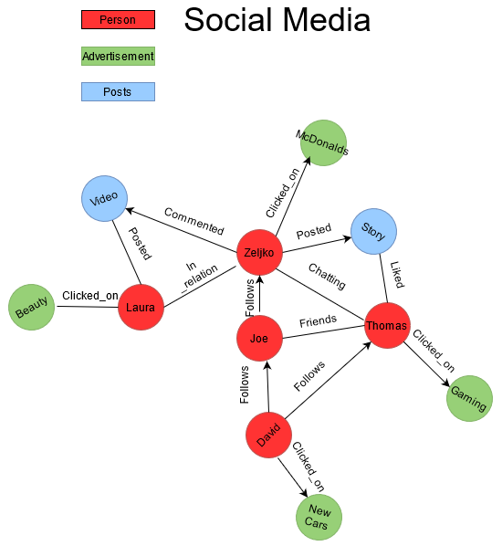

# Springboot Application with Neo4J 

Read Blog/Documentation:  https://zeljko-predjeskovic.github.io/springboot-social-media/

## Sources

Spring: https://spring.io/guides/gs/accessing-data-neo4j/

Neo4J: https://neo4j.com/developer/spring-data-neo4j/

## Start the app

Make sure that you work in a Java 16 environment.

    git clone https://github.com/Zeljko-Predjeskovic/springboot-social-media.git

    cd springboot-social-media

    mvn clean 

    mvn install

    run application on IDE

Define your Neo4j connection in src/main/resources/application.properties

    spring.data.neo4j.uri=bolt://localhost:7687 // your connection path
    spring.data.neo4j.username=neo4j            // database username
    spring.data.neo4j.password=secret           // database password

The value written in this example is the default connection. You actually don't have to write anything if you
use a default connection. Notice that Neo4j uses a [Bolt](https://en.wikipedia.org/wiki/Bolt_(network_protocol)) network protocol to connect. It will not except a http 
connection.

### Example of a social media schema

A small example in how my nodes and relations are going to be build.

